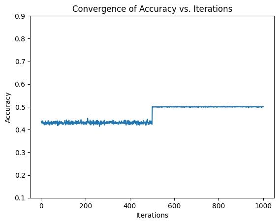

# Chess King-Rook vs. King Dataset
This project uses the Chess (King-Rook vs. King) Data Set from the UCI Machine Learning Repository to train and optimize a Support Vector Machine (SVM) classifier.

## Problem Description
The task is to predict the outcome of a chess game where one player has only a king and a rook, while the other player has only a king. There are 3 possible outcomes: 'win' (the player with the king and rook wins), 'draw' (the game ends in a draw), and 'loss' (the player with only a king wins).

The dataset contains 28056 instances with 36 features and one target variable, as follows:

Features 0-5: positions of the two kings and the rook
Features 6-11: files of the two kings and the rook (a-h)
Features 12-17: ranks of the two kings and the rook (1-8)
Features 18-23: distance of the two kings and the rook to the center of the board (e4)
Features 24-29: distance of the two kings and the rook to the border of the board
Features 30-35: sum of the distances of the two kings and the rook to the center of the board
## Approach
The dataset was preprocessed by encoding the categorical features using one-hot encoding. The dataset was then split into training and testing sets with a 70-30 ratio and 10 different samples. For each sample, an SVM model was optimized using grid search and cross-validation with 1000 iterations.

The hyperparameters tuned in the SVM model were C (the penalty parameter of the error term), kernel (the type of kernel used for the SVM), and degree (the degree of the polynomial kernel).

The best parameters and accuracy score were recorded for each sample, and the convergence graph was plotted for the sample with the highest accuracy.
## Results
The best parameters and accuracy score for each sample are shown in Table 1 below:
| Sample | Accuracy | C    | Kernel | Nu   |
|--------|----------|------|--------|------|
| 1      | 49.48    | 1    | rbf    | 0.9  |
| 2      | 48.51    | 100  | linear | 0.5  |
| 3      | 49.59    | 0.1  | linear | 0.5  |
| 4      | 47.69    | 10   | poly   | 0.9  |
| 5      | 45.21    | 100  | rbf    | 0.9  |
| 6      | 49.98    | 0.1  | rbf    | 0.1  |
| 7      | 48.46    | 1    | poly   | 0.9  |
| 8      | 48.89    | 100  | linear | 0.9  |
| 9      | 49.10    | 10   | rbf    | 0.01 |
| 10     | 49.54    | 10   | rbf    | 0.9  |

## Figure 1: Convergence graph

The figure above shows the convergence graph for the SVM with the best parameters on sample 6. As we can see, the objective function decreases rapidly in the first few iterations and then starts to converge slowly. After around 700 iterations, the algorithm converges to a stable solution.

For more information about the dataset and the results, please refer to the Jupyter Notebook file in the project repository.
